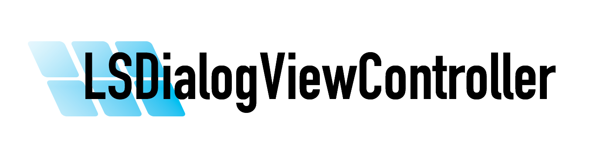

<div style="text-align: center; width: 100%">

</div>

[](https://developer.apple.com/swift)
[](http://cocoapods.org/pods/LSDialogViewController)
[](http://cocoapods.org/pods/LSDialogViewController)
[](https://swift.org/package-manager/)
[](https://cocoapods.org/pods/LSDialogViewController)
[](https://github.com/Carthage/Carthage)


`LSDialogViewController` makes it easy to display a custom view as a dialog with various animation patterns.


# Requirements
- Swift 5.0+
- iOS 12.0+

# Installation

### Swift Package Manager (Recommended)

Add the following to your `Package.swift`:

```swift
dependencies: [
    .package(url: "https://github.com/daihase/LSDialogViewController.git", from: "4.1")
]
```

Or in Xcode: **File → Add Package Dependencies...** → Enter the repository URL:

```
https://github.com/daihase/LSDialogViewController.git
```

### CocoaPods

LSDialogViewController is available through [CocoaPods](http://cocoapods.org). To install it, simply add the following line to your Podfile:

```ruby
pod 'LSDialogViewController', '~> 4.0'
```

### Carthage

Add the following to your `Cartfile`:

```ruby
github "daihase/LSDialogViewController"
```

Then run:

```
$ carthage update
```

# Usage

To run the example project, clone the repo and run `pod install` from the `Example` directory.
There is also an SPM-based example in the `ExampleSPM` directory — just open `ExampleSPM.xcodeproj` and build.

#### Examples

```swift
import LSDialogViewController

// Show a dialog
let dialogViewController = CustomDialogViewController(nibName: "CustomDialog", bundle: nil)
dialogViewController.delegate = self
presentDialogViewController(dialogViewController, animationPattern: .fadeInOut)

// Dismiss the dialog
dismissDialogViewController(.fadeInOut)
```

# Configuration

```swift
presentDialogViewController(
    // Required: the view controller to display as a dialog
    dialogViewController: UIViewController,
    // Animation pattern (default: .fadeInOut)
    animationPattern: LSAnimationPattern,
    // Background view type (default: .solid)
    backgroundViewType: LSDialogBackgroundViewType,
    // Whether tapping the background dismisses the dialog (default: true)
    dismissButtonEnabled: Bool,
    // Called after the dialog is presented
    completion: (() -> Swift.Void)?
)
```

### Background View Types

You can choose from `.solid`, `.gradient`, or `.none`:

![Image][1]
.
![Image][2]

## License

LSDialogViewController is available under the MIT license. See the LICENSE file for more info.


[1]:
https://raw.github.com/wiki/daihase/resource_manage/gifs/zoominout_gradient.gif
[2]:
https://raw.github.com/wiki/daihase/resource_manage/gifs/slide-bottombottom_none.gif
